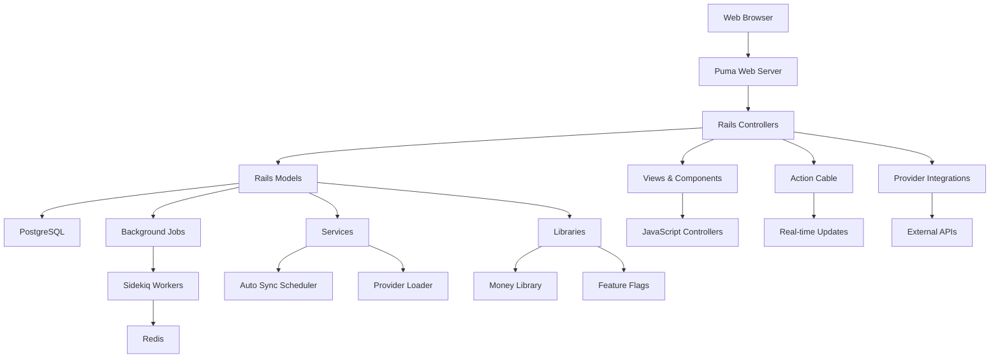

<!-- generated-by: gsd-doc-writer -->
# Architecture Overview

Sure is a personal finance and wealth management application built with Ruby on Rails, designed to help users track accounts, transactions, investments, and financial goals. The application follows a traditional Rails MVC architecture with additional layers for provider integrations, background job processing, and real-time updates.

## System Overview

Sure is a monolithic Rails application that uses PostgreSQL for data persistence, Redis for background job processing and caching, and follows RESTful conventions for API design. The system integrates with multiple financial data providers (Plaid, SimpleFIN, SnapTrade, etc.) to aggregate financial data, processes this data through various import and enrichment pipelines, and presents it through a web interface with real-time updates via Action Cable. The architecture emphasizes data integrity through proper transaction handling, robust import processing, and extensive background job scheduling for data synchronization.

## Component Diagram

## Data Flow

A typical request flows through the system as follows:

1. **User Request**: Browser sends HTTP request to Puma web server
2. **Routing**: Rails router matches request URL to controller action
3. **Controller Processing**: Controller receives request, retrieves/manipulates data through models, and schedules background jobs if needed
4. **Data Access**: Models interact with PostgreSQL using ActiveRecord ORM, applying business logic and validations
5. **Background Processing**: For data-intensive operations (provider syncs, imports, AI features), controllers enqueue Sidekiq jobs that process asynchronously
6. **Provider Integration**: Background jobs communicate with external financial APIs (Plaid, SimpleFIN, etc.) to fetch account and transaction data
7. **Data Enrichment**: Retrieved data passes through import processors, categorization engines, and rule applications
8. **Response**: Controller renders view or returns JSON response, which may include real-time updates via Action Cable
9. **Client Updates**: JavaScript controllers handle DOM updates and interactive features

For provider synchronization specifically: A user connects a provider → Item model stores credentials → Sync job is scheduled → Background job fetches data from provider API → Entry models are created/updated → Financial summaries are recalculated → Real-time notification sent via Action Cable.

## Key Abstractions

- **Account**: `app/models/account.rb` - Central model representing financial accounts (banking, investment, crypto, credit cards), with polymorphic associations to account types and balance calculations
- **Entry**: `app/models/entry.rb` - Core transaction abstraction that unifies different transaction types (banking entries, investment entries, trades) with currency handling and categorization
- **Family**: `app/models/family.rb` - Multi-tenant organization unit that groups users, accounts, and shared financial data with role-based access control
- **Provider System**: `app/models/provider.rb` and `app/models/*_item.rb` - Abstraction for financial data providers (Plaid, SimpleFIN, etc.) with connection management, credential storage, and sync orchestration
- **Import Pipeline**: `app/models/import.rb` and related import classes - Data import abstraction supporting multiple formats (CSV, QIF, PDF) with validation, mapping, and batch processing
- **Rule Engine**: `app/models/rule.rb` - Transaction categorization and transformation system with pattern matching, condition evaluation, and batch application
- **Sync Orchestration**: `app/models/sync.rb` and `app/services/auto_sync_scheduler.rb` - Background job coordination for provider data synchronization with error handling and retry logic
- **Money Handling**: `lib/money.rb` - Custom money arithmetic library handling multi-currency operations, exchange rates, and precision calculations
- **Component System**: `app/components/` - Rails view components following design system patterns (DS::* components) for reusable UI elements
- **Job System**: `app/jobs/` - Sidekiq background job classes for asynchronous processing of data imports, provider syncs, and maintenance tasks

## Directory Structure Rationale

- **app/**: Core Rails MVC structure with controllers handling web requests, models encapsulating business logic and data access, views rendering HTML responses, and components providing reusable UI elements
- **app/controllers/api/**: RESTful API endpoints for external integrations and AJAX requests, organized by version and resource
- **app/models/**: ActiveRecord models organized by domain entity (accounts, transactions, providers) with concerns and namespaced models for complex entities
- **app/services/**: Application-level services that orchestrate business logic across multiple models (provider loading, rate limiting, sync scheduling)
- **app/jobs/**: Background job definitions using Sidekiq for async processing, organized by function (sync jobs, import jobs, maintenance jobs)
- **app/channels/**: Action Cable channels for real-time WebSocket communication
- **app/components/**: View components following design system patterns, with DS namespace for design system primitives and UI namespace for application-specific components
- **app/javascript/**: Frontend JavaScript using Stimulus controllers for interactive behavior, utilities for common operations, and services for API communication
- **config/**: Application configuration including routes, environments, database connections, provider credentials, and scheduled jobs
- **db/**: Database schema, migrations, and seed data for initializing the application with sample data
- **lib/**: Shared libraries and utilities not specific to Rails, including custom money handling, feature flags, and provider-specific client libraries
- **test/**: Test suite mirroring the app directory structure, following Rails conventions for unit and integration testing with Minitest